# Flujo Vehicular por Fases 1-9 (Notion Friendly)

**Sugerencias de mejora:**

* Uniformizar nombres de nodos `start` y `fin` con sufijos claros (`FaseX_start`, `FaseX_fin`).
* Usar `classDef fin_exito` y `fin_error` para distinguir cierres exitosos o con incidente.
* Mantener coherencia en formatos de decisiones `{"¿…?"}`.
* Opcional: agregar enlaces entre fases críticas si se desea flujo continuo.

```mermaid
flowchart TD
  classDef fin_exito fill:#c8e6c9,stroke:#2e7d32;
  classDef fin_error fill:#ffcdd2,stroke:#c62828;

  %% Fase 1: Recepción y evaluación inicial
  subgraph F1["Fase 1: Recepción y evaluación inicial del vehículo"]
    Fase1_start(["Inicio Fase 1"])
    Fase1_start --> Fase1_eval["Recepción y evaluación visual/técnica"]
    Fase1_eval --> Fase1_datosOK{"¿Datos completos y estado evaluable?"}
    Fase1_datosOK -- No --> Fase1_rechazo["Rechazo o reclamo por ingreso incompleto"]
    Fase1_rechazo --> Fase1_finErr(["Fin Fase 1 (error)"])
    class Fase1_finErr fin_error;
    Fase1_datosOK -- Sí --> Fase1_carga["Carga de datos en sistema de peritaje"]
    Fase1_carga --> Fase1_cargaOK{"¿Carga exitosa?"}
    Fase1_cargaOK -- No --> Fase1_retryCarga["Reintentar carga de datos"]
    Fase1_retryCarga -.-> Fase1_carga
    Fase1_cargaOK -- Sí --> Fase1_com["Comunicación a encargados comerciales"]
    Fase1_com --> Fase1_comOK{"¿Comunicación exitosa?"}
    Fase1_comOK -- No --> Fase1_retryCom["Reintentar comunicación"]
    Fase1_retryCom -.-> Fase1_com
    Fase1_comOK -- Sí --> Fase1_ingreso["Ingreso físico al stock"]
    Fase1_ingreso --> Fase1_valid["Validación en canal general"]
    Fase1_valid --> Fase1_finSuc(["Fin Fase 1: Vehículo listo para planificación"])
    class Fase1_finSuc fin_exito;
  end

  %% Fase 2: Planificación e intervenciones
  subgraph F2["Fase 2: Planificación y alistamiento de intervenciones"]
    Fase2_start(["Inicio Fase 2: Validación de peritajes"])
    Fase2_start --> Fase2_valid["Validación en sistema de peritajes"]
    Fase2_valid --> Fase2_plan["Planificación y priorización de tareas"]
    Fase2_plan --> Fase2_checkProv["Verificación de disponibilidad de proveedor"]
    Fase2_checkProv --> Fase2_provOK{"¿Proveedor disponible?"}
    Fase2_provOK -- No --> Fase2_taller["Intervención en taller propio"]
    Fase2_taller --> Fase2_notifInt["Notificación al preparador interno"]
    Fase2_notifInt --> Fase2_prepInt["Preparación y reparación en taller"]
    Fase2_prepInt --> Fase2_updInt["Actualización de seguimiento interno"]
    Fase2_updInt --> Fase2_confInt{"¿Trabajo finalizado?"}
    Fase2_confInt -- No --> Fase2_retryInt["Esperar y reintentar"]
    Fase2_retryInt -.-> Fase2_confInt
    Fase2_confInt -- Sí --> Fase2_updSys1["Actualizar sistema"]
    Fase2_provOK -- Sí --> Fase2_reqProv["Solicitud de turno al proveedor"]
    Fase2_reqProv --> Fase2_notifProv["Notificación al proveedor"]
    Fase2_notifProv --> Fase2_prepVeh["Preparación para traslado"]
    Fase2_prepVeh --> Fase2_envio["Envío al proveedor"]
    Fase2_envio --> Fase2_confEnt["Confirmación de entrega"]
    Fase2_confEnt --> Fase2_updProv["Actualización de seguimiento proveedor"]
    Fase2_updProv --> Fase2_confProv{"¿Trabajo finalizado?"}
    Fase2_confProv -- No --> Fase2_retryProv["Esperar y reintentar"]
    Fase2_retryProv -.-> Fase2_confProv
    Fase2_confProv -- Sí --> Fase2_updSys2["Actualizar sistema"]
    Fase2_updSys1 --> Fase2_finSuc(["Fin Fase 2: Inspección final solicitada"])
    Fase2_updSys2 --> Fase2_finSuc
    class Fase2_finSuc fin_exito;
  end

  %% Fase 3: Pedido de repuestos
  subgraph F3["Fase 3: Pedido de repuestos"]
    Fase3_start(["Inicio Fase 3: Pedido de repuestos"])
    Fase3_start --> Fase3_recep["Recepción del pedido"]
    Fase3_recep --> Fase3_valInv["Validar inventario"]
    Fase3_valInv --> Fase3_stockOK{"¿Hay stock disponible?"}
    Fase3_stockOK -- Sí --> Fase3_notifPrep["Notificar al preparador"]
    Fase3_notifPrep --> Fase3_ctrlCal["Control de calidad"]
    Fase3_ctrlCal --> Fase3_comTaller["Comunicar a administrador de turnos"]
    Fase3_comTaller --> Fase3_verUso["Verificar instalación"]
    Fase3_verUso --> Fase3_instOK{"¿Instalado?"}
    Fase3_instOK -- No --> Fase3_alertRobo["Alerta posible desvío"]
    Fase3_alertRobo --> Fase3_finErr(["Fin Fase 3 (incidente)"])
    class Fase3_finErr fin_error;
    Fase3_instOK -- Sí --> Fase3_finSuc(["Fin Fase 3: Repuesto instalado"])
    class Fase3_finSuc fin_exito;
    Fase3_stockOK -- No --> Fase3_verProv["Verificar proveedor"]
    Fase3_verProv --> Fase3_genPedido["Generar pedido"]
    Fase3_genPedido --> Fase3_seg["Seguimiento a proveedor"]
    Fase3_seg --> Fase3_recibido{"¿Repuesto en condiciones?"}
    Fase3_recibido -- No --> Fase3_reclamo["Reclamar a proveedor"]
    Fase3_reclamo --> Fase3_seg
    Fase3_recibido -- Sí --> Fase3_notifPrep
  end

  %% Fase 4: Recepción de mercancías
  subgraph F4["Fase 4: Recepción de mercancías"]
    Fase4_start(["Inicio Fase 4: Recepción de mercancías"])
    Fase4_start --> Fase4_inventario["Gestionar inventario"]
    Fase4_inventario --> Fase4_suministro["Suministrar al taller"]
    Fase4_suministro --> Fase4_devoluciones{"¿Hubo devoluciones?"}
    Fase4_devoluciones -- Sí --> Fase4_gestDev["Gestionar devoluciones"]
    Fase4_gestDev --> Fase4_updProv["Actualizar proveedor"]
    Fase4_updProv --> Fase4_reportes["Analizar y generar reportes"]
    Fase4_reportes --> Fase4_finSuc(["Fin Fase 4"])
    class Fase4_finSuc fin_exito;
    Fase4_devoluciones -- No --> Fase4_updProv
  end

  %% Fase 5: Vehículo recibido desde intervención o gestión vehicular
  subgraph F5["Fase 5: Vehículo recibido desde intervención o gestión vehicular"]
    Fase5_start(["Inicio Fase 5: Vehículo recibido desde intervención o gestión vehicular"])
    Fase5_start --> Fase5_rentable{"¿En condiciones de venta sin intervención?"}
    Fase5_rentable -- Sí --> Fase5_revBas["Revisión básica (limpieza, estética y documentos)"]
    Fase5_revBas --> Fase5_aprDirect["Aprobación para venta sin intervención"]
    Fase5_aprDirect --> Fase5_transferir["Transferir a área de ventas"]
    Fase5_transferir --> Fase5_registrar["Registrar vehículo en sistema comercial"]
    Fase5_registrar --> Fase5_finSuc(["Fin Fase 5"])
    class Fase5_finSuc fin_exito;
    Fase5_rentable -- No --> Fase5_verInter["Verificar intervenciones realizadas"]
    Fase5_verInter --> Fase5_checklist["Completar checklist de control de calidad"]
    Fase5_checklist --> Fase5_prueba["Realizar prueba final (si aplica)"]
    Fase5_prueba --> Fase5_cumple{"¿Cumple criterios técnicos y estéticos?"}
    Fase5_cumple -- No --> Fase5_regFallas["Registrar fallas o desvíos"]
    Fase5_regFallas --> Fase5_notifTall["Notificar al taller para corrección"]
    Fase5_notifTall --> Fase5_verInter
    Fase5_cumple -- Sí --> Fase5_aprTrans["Autorizar traspaso a venta"]
    Fase5_aprTrans --> Fase5_transferir
  end

  %% Fase 6: Evaluación técnica inicial
  subgraph F6["Fase 6: Evaluación técnica inicial"]
    Fase6_start(["Inicio Fase 6: Evaluación técnica inicial"])
    Fase6_start --> Fase6_peritaje["Revisión del peritaje"]
    Fase6_peritaje --> Fase6_costos["Estimación de costos base"]
    Fase6_costos --> Fase6_criterios["Aplicación de precios y márgenes"]
    Fase6_criterios --> Fase6_precot["Emisión de pre-cotización"]
    Fase6_precot --> Fase6_valida{"¿Rentable intervenir?"}
    Fase6_valida -- No --> Fase6_ventaDirecta["Enviar a venta sin intervención"]
    Fase6_ventaDirecta --> Fase6_comunica["Comunicar pre-cotización a responsable"]
    Fase6_comunica --> Fase6_finSuc(["Fin Fase 6"])
    class Fase6_finSuc fin_exito;
    Fase6_valida -- Sí --> Fase6_cont["Continuar planificación de intervención"]
    Fase6_cont --> Fase2_start
  end

  %% Fase 7: Aprobación de trabajos
  subgraph F7["Fase 7: Aprobación de trabajos"]
    Fase7_start(["Inicio Fase 7: Aprobación de trabajos"])
    Fase7_start --> Fase7_recibe["Recepción de orden de intervención"]
    Fase7_recibe --> Fase7_asigna["Asignación de tareas al equipo"]
    Fase7_asigna --> Fase7_ejecuta["Ejecución técnica en taller"]
    Fase7_ejecuta --> Fase7_ctrlCal{"¿Control interno de calidad aprobado?"}
    Fase7_ctrlCal -- No --> Fase7_corrige["Realizar correcciones"]
    Fase7_corrige --> Fase7_ejecuta
    Fase7_ctrlCal -- Sí --> Fase7_informe["Generar informe de avances"]
    Fase7_informe --> Fase7_fin(["Fin Fase 7"])
    class Fase7_fin fin_exito;
  end

  %% Fase 8: Consolidar datos técnicos
  subgraph F8["Fase 8: Consolidar datos técnicos"]
    Fase8_start(["Inicio Fase 8: Consolidar datos técnicos"])
    Fase8_start --> Fase8_consolidar["Consolidar costos finales"]
    Fase8_consolidar --> Fase8_aplicar["Precios y márgenes"]
    Fase8_aplicar --> Fase8_revision["Aprobación de costo comercial"]
    Fase8_revision --> Fase8_emision["Emitir cotización formal"]
    Fase8_emision --> Fase8_comunicar["Comunicar cotización al cliente"]
    Fase8_comunicar --> Fase8_cliAprueba{"¿Cliente aprueba la cotización?"}
    Fase8_cliAprueba -- No --> Fase8_ajusta["Ajustar cotización"]
    Fase8_ajusta --> Fase8_emision
    Fase8_cliAprueba -- Sí --> Fase8_fin(["Fin Fase 8: Vehículo señado"])
    class Fase8_fin fin_exito;
  end

  %% Fase 9: Cliente confirma compra
  subgraph F9["Fase 9: Cliente confirma compra"]
    Fase9_start(["Inicio Fase 9: Cliente confirma compra"])
    Fase9_start --> Fase9_prepDoc["Preparar documentación de venta"]
    Fase9_prepDoc --> Fase9_firma["Firma del contrato"]
    Fase9_firma --> Fase9_tramites["Gestionar trámites legales"]
    Fase9_tramites --> Fase9_cargaSis["Cargar información en sistema"]
    Fase9_cargaSis --> Fase9_valida["¿Validación final de gestoría aprobada?"]
    Fase9_valida -- Sí --> Fase9_finSuc(["Fin Fase 9"])
    class Fase9_finSuc fin_exito;
    Fase9_valida -- No --> Fase9_finErr(["Fin Fase 9 (incidente)"])
    class Fase9_finErr fin_error;
  end
```

