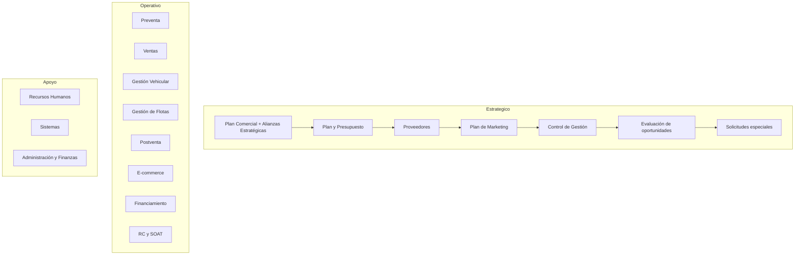

# Mapa General de Procesos

Este diagrama resume los procesos estratégicos, operativos y de apoyo.

```mermaid
flowchart TB
  %% Procesos estratégicos
  subgraph Estrategico
    PC["Plan Comercial + Alianzas Estratégicas"]
    PPE["Plan y Presupuesto"]
    PROV["Proveedores"]
    MKT["Plan de Marketing"]
    CTRL["Control de Gestión"]
    OPORT["Evaluación de oportunidades"]
    SPEC["Solicitudes especiales"]
    PC --> PPE --> PROV --> MKT --> CTRL --> OPORT --> SPEC
  end

  %% Procesos operativos
  subgraph Operativo
    PREV["Preventa"]
    VENT["Ventas"]
    GV["Gestión Vehicular"]
    GF["Gestión de Flotas"]
    POST["Postventa"]
    ECO["E-commerce"]
    FIN["Financiamiento"]
    RC["RC y SOAT"]
  end

  %% Procesos de apoyo
  subgraph Apoyo
    HR["Recursos Humanos"]
    IT["Sistemas"]
    ADM["Administración y Finanzas"]
  end
```

Puedes abrir este archivo en GitHub para ver el diagrama renderizado.
